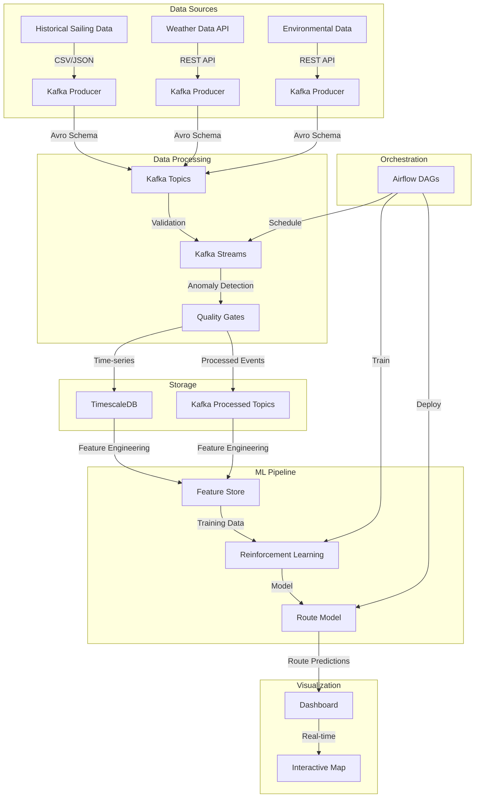

# Maritime Route Optimization Exercise: Reinforcement Learning for Vessel Navigation

## Overview
This exercise simulates a maritime route optimization system using reinforcement learning. The system processes historical sailing data, weather conditions, and environmental hazards to optimize vessel routes for fuel efficiency and safety.

## Architecture Components



## Project Structure
```
maritime-rl/
├── helm/
│   ├── kafka/
│   ├── timescaledb/
│   ├── airflow/
│   └── argocd/
├── data/
│   ├── historical/
│   ├── weather/
│   └── environmental/
├── src/
│   ├── maritime/
│   │   ├── schemas/
│   │   ├── producers/
│   │   ├── processors/
│   │   ├── features/
│   │   ├── models/
│   │   └── visualization/
├── scripts/
│   ├── start_services_sequential.sh
│   ├── run_demo.sh
│   ├── monitor_kafka.py
│   └── start_dashboard.sh
├── tests/
├── docker/
└── docs/
    └── user_guide.md
```

## Data Schemas

### 1. Historical Sailing Data
```json
{
  "type": "record",
  "name": "SailingRecord",
  "fields": [
    {"name": "vessel_id", "type": "string"},
    {"name": "timestamp", "type": "long"},
    {"name": "position", "type": {
      "type": "record",
      "name": "Position",
      "fields": [
        {"name": "latitude", "type": "double"},
        {"name": "longitude", "type": "double"}
      ]
    }},
    {"name": "speed", "type": "double"},
    {"name": "heading", "type": "double"},
    {"name": "fuel_consumption", "type": "double"},
    {"name": "weather_conditions", "type": {
      "type": "record",
      "name": "Weather",
      "fields": [
        {"name": "wind_speed", "type": "double"},
        {"name": "wave_height", "type": "double"},
        {"name": "current_speed", "type": "double"}
      ]
    }}
  ]
}
```

### 2. Weather Data
```json
{
  "type": "record",
  "name": "WeatherData",
  "fields": [
    {"name": "timestamp", "type": "long"},
    {"name": "location", "type": {
      "type": "record",
      "name": "Location",
      "fields": [
        {"name": "latitude", "type": "double"},
        {"name": "longitude", "type": "double"}
      ]
    }},
    {"name": "forecast", "type": {
      "type": "array",
      "items": {
        "type": "record",
        "name": "ForecastPoint",
        "fields": [
          {"name": "time", "type": "long"},
          {"name": "wind_speed", "type": "double"},
          {"name": "wind_direction", "type": "double"},
          {"name": "wave_height", "type": "double"},
          {"name": "current_speed", "type": "double"},
          {"name": "current_direction", "type": "double"}
        ]
      }
    }}
  ]
}
```

### 3. Environmental Data
```json
{
  "type": "record",
  "name": "EnvironmentalData",
  "fields": [
    {"name": "timestamp", "type": "long"},
    {"name": "location", "type": {
      "type": "record",
      "name": "Location",
      "fields": [
        {"name": "latitude", "type": "double"},
        {"name": "longitude", "type": "double"}
      ]
    }},
    {"name": "hazards", "type": {
      "type": "array",
      "items": {
        "type": "record",
        "name": "Hazard",
        "fields": [
          {"name": "type", "type": "string"},
          {"name": "severity", "type": "int"},
          {"name": "radius", "type": "double"},
          {"name": "description", "type": "string"}
        ]
      }
    }}
  ]
}
```

## Implementation Steps

### 1. Local Development Environment Setup
```bash
# Install Docker and Docker Compose
brew install docker docker-compose

# For K8s deployment (optional)
brew install kubectl helm

# Create the required network
docker network create maritime-network

# Start all services in the correct sequence
./maritime-rl/scripts/start_services_sequential.sh
```

### 2. Data Generation
- Create synthetic historical sailing data
- Simulate weather API responses
- Generate environmental hazard data
- Implement data quality checks

### 3. Kafka Setup
- Configure Schema Registry
- Set up topics with appropriate partitions
- Implement producers for each data type
- Create validation rules

### 4. Kafka Streams Implementation
```java
// Example Kafka Streams topology for data processing
StreamsBuilder builder = new StreamsBuilder();

KStream<String, SailingRecord> vesselData = builder.stream(
    "vessel_sailing_data",
    Consumed.with(Serdes.String(), sailingRecordSerde)
);

// Data validation and cleaning
KStream<String, SailingRecord> validData = vesselData
    .filter((key, value) -> value != null && isValid(value));

// Calculate derived metrics
KStream<String, EnrichedSailingRecord> enrichedData = validData
    .mapValues(value -> enrichWithMetrics(value));

// Detect anomalies
KStream<String, EnrichedSailingRecord> withAnomalyFlags = enrichedData
    .mapValues(value -> detectAnomalies(value));

// Write to output topic
withAnomalyFlags.to(
    "processed_sailing_data",
    Produced.with(Serdes.String(), enrichedSailingRecordSerde)
);
```

### 5. TimescaleDB Configuration
```sql
-- Create hypertable for vessel telemetry
CREATE TABLE vessel_telemetry (
    time TIMESTAMPTZ NOT NULL,
    vessel_id TEXT NOT NULL,
    position_lat DOUBLE PRECISION,
    position_lon DOUBLE PRECISION,
    speed DOUBLE PRECISION,
    heading DOUBLE PRECISION,
    fuel_consumption DOUBLE PRECISION,
    weather_wind_speed DOUBLE PRECISION,
    weather_wave_height DOUBLE PRECISION,
    weather_current_speed DOUBLE PRECISION
);

SELECT create_hypertable('vessel_telemetry', 'time',
    chunk_time_interval => INTERVAL '1 day',
    compress_after => INTERVAL '7 days'
);
```

### 6. Feature Engineering
- Calculate vessel performance metrics
- Create weather impact features
- Generate hazard avoidance features
- Build composite features for RL

### 7. Reinforcement Learning Model
- Define state space (vessel position, weather, hazards)
- Create action space (heading changes, speed adjustments)
- Implement reward function
- Train model using historical data

### 8. Airflow DAGs
```python
from airflow import DAG
from airflow.operators.python import PythonOperator
from datetime import datetime, timedelta

default_args = {
    'owner': 'airflow',
    'depends_on_past': False,
    'start_date': datetime(2024, 1, 1),
    'email_on_failure': False,
    'email_on_retry': False,
    'retries': 1,
    'retry_delay': timedelta(minutes=5),
}

dag = DAG(
    'maritime_route_optimization',
    default_args=default_args,
    description='Maritime route optimization pipeline',
    schedule_interval='@daily',
)

# Define tasks
data_validation = PythonOperator(
    task_id='validate_data',
    python_callable=validate_data,
    dag=dag,
)

feature_engineering = PythonOperator(
    task_id='calculate_features',
    python_callable=calculate_features,
    dag=dag,
)

model_training = PythonOperator(
    task_id='train_model',
    python_callable=train_model,
    dag=dag,
)

model_deployment = PythonOperator(
    task_id='deploy_model',
    python_callable=deploy_model,
    dag=dag,
)

# Set task dependencies
data_validation >> feature_engineering >> model_training >> model_deployment
```

### 9. Visualization Dashboard
- Create Flask-based dashboard
- Implement interactive map
- Show real-time route predictions
- Display model performance metrics

## Reinforcement Learning Details

### RL Environment

The RL environment simulates maritime navigation with:

- **State space**: 
  - Vessel position (lat, lon)
  - Vessel state (speed, heading, fuel level)
  - Local weather conditions
  - Nearby hazards
  - Distance to destination

- **Action space**:
  - Speed adjustments (increase, maintain, decrease)
  - Heading adjustments (5° increments)

- **Reward function**:
  ```python
  def calculate_reward(state, action, next_state):
      reward = 0
      
      # Distance to goal reward
      prev_distance = haversine(state.position, GOAL_POSITION)
      current_distance = haversine(next_state.position, GOAL_POSITION)
      reward += (prev_distance - current_distance) * DISTANCE_REWARD_FACTOR
      
      # Fuel consumption penalty
      reward -= next_state.fuel_consumption * FUEL_PENALTY_FACTOR
      
      # Safety rewards/penalties
      if is_near_hazard(next_state.position):
          reward -= HAZARD_PENALTY
      
      # Weather condition penalties
      weather_risk = calculate_weather_risk(next_state)
      reward -= weather_risk * WEATHER_PENALTY_FACTOR
      
      # Arrival bonus
      if is_at_destination(next_state.position):
          reward += DESTINATION_BONUS
          
      return reward
  ```

### Algorithm Choice
- **Proximal Policy Optimization (PPO)** for its sample efficiency and stability
- Deep neural network to approximate policy and value functions
- Experience replay to improve sample efficiency

## Running the System

### 1. Starting Services
Start all services in the correct sequence:

```bash
./maritime-rl/scripts/start_services_sequential.sh
```

This script ensures that:
- Services are started in the correct dependency order
- Each service is healthy before starting dependent services
- Required networks and volumes are created

### 2. Running the Demo
Run the demo script to generate test data and process it:

```bash
./maritime-rl/scripts/run_demo.sh
```

The demo will:
- Generate vessel sailing data with realistic patterns
- Process data through Kafka Streams
- Store processed data in TimescaleDB
- Verify data is stored correctly
- Start the visualization dashboard

### 3. Access Points
The system consists of several components accessible via web interfaces:

- **Kafka UI**: http://localhost:8080
- **Schema Registry**: http://localhost:8081
- **pgAdmin**: http://localhost:5050 (admin@maritime.com / maritime_admin)
- **Airflow**: http://localhost:8090 (admin / maritime_admin)
- **Dashboard**: http://localhost:5500

### 4. Working with Airflow
To trigger the data pipeline and model training:

1. Access Airflow at http://localhost:8090
2. Enable both the `maritime_data_pipeline` and `maritime_model_training` DAGs
3. Trigger the DAGs manually using the "play" button
4. Monitor execution in the Airflow UI

### 5. Monitoring
You can monitor Kafka messages in real-time using:

```bash
./scripts/monitor_kafka.py --topics vessel_sailing_data processed_sailing_data
```

### 6. Using the Dashboard
The dashboard provides visualization of vessel data and routes:

1. Access the dashboard at http://localhost:5500
2. View vessel positions on the map
3. Click vessels to see detailed telemetry
4. Compare standard routes with optimized routes
5. Monitor fuel consumption and efficiency metrics

## Monitoring

### Key Metrics to Monitor
- Kafka consumer lag
- Kafka Streams processing throughput
- TimescaleDB query performance
- Model training metrics:
  - Average reward per episode
  - Success rate (reaching destination)
  - Fuel efficiency
- System resource utilization

### Monitoring Tools
- Prometheus for metrics collection
- Grafana for visualization
- Kafka UI for Kafka monitoring
- Airflow monitoring for DAG status

### Dashboard Layout
```
+---------------------+---------------------+
|                     |                     |
|   Route Map View    |   System Metrics    |
|                     |                     |
+---------------------+---------------------+
|                     |                     |
| Vessel Performance  |   Model Metrics     |
|                     |                     |
+---------------------+---------------------+
|                                           |
|           Data Pipeline Status            |
|                                           |
+-------------------------------------------+
```

## Current Implementation and Future Roadmap

### Current Implementation: Data Pipeline & Basic Optimization

#### End-to-End Business Flow

##### 1. Data Sources (The Vessels)
- **Real-World Equivalent**: Commercial shipping vessels with IoT sensors and GPS tracking
- **Current Implementation**: `./maritime-rl/scripts/generate_vessel_data.py`
- **Technical Details**:
  - Simulates 3 vessels (vessel_1, vessel_2, vessel_3) moving through maritime routes
  - Generates telemetry including position, speed, heading, and fuel consumption
  - Creates weather context (wind_speed, wave_height, current_speed)
  - Streams data points approximately every second
  - Data structured as JSON objects with timestamp precision

##### 2. Data Ingestion (Communication Channel)
- **Real-World Equivalent**: Satellite/cellular data transmission from vessels to shore
- **Current Implementation**: Kafka topic "vessel_sailing_data"
- **Technical Details**:
  - 3 partitions for parallel processing
  - JSON serialization for message format validation
  - Continuous data flow with timestamp-based ordering
  - Reliable buffer for downstream system failures
  - Observable via Kafka monitoring tools

##### 3. Data Processing (Central Operations Platform)
- **Real-World Equivalent**: Shipping company's operations platform
- **Current Implementation**: `maritime_pipeline_dag.py` ("maritime_data_pipeline" DAG)
- **Technical Details**:
  - `check_kafka_topics` task validates communication channels
  - `run_sailing_processor` transforms raw vessel data and adds metrics
  - `check_data_quality_task` ensures data meets quality thresholds
  - `store_in_timescaledb` persists validated data for analysis
  - Tasks connected with proper dependency management
  - Scheduled to run every 15 minutes

##### 4. Data Storage (Operational Database)
- **Real-World Equivalent**: Company's vessel operations database
- **Current Implementation**: TimescaleDB "vessel_telemetry" table
- **Technical Details**:
  - Optimized schema for time-series vessel data:
    ```sql
    CREATE TABLE vessel_telemetry (
        timestamp TIMESTAMPTZ NOT NULL,
        vessel_id TEXT NOT NULL,
        position GEOMETRY(POINT, 4326),
        speed DOUBLE PRECISION,
        heading DOUBLE PRECISION,
        fuel_consumption DOUBLE PRECISION,
        quality_score DOUBLE PRECISION
    )
    ```
  - Spatial data support via PostGIS
  - Stored 4,620+ records with uniform distribution across vessels
  - Optimized for time-series queries and spatial analysis

##### 5. Current Approach to "Optimization"
- **Real-World Equivalent**: Basic data analysis for operational efficiency
- **Current Implementation**: `maritime_model_training` DAG
- **Technical Details**:
  - **Data Retrieval**: Queries TimescaleDB for vessel history:
    ```sql
    SELECT timestamp, vessel_id, ST_X(position::geometry) as lon,
           ST_Y(position::geometry) as lat, speed, heading, fuel_consumption
    FROM vessel_telemetry ORDER BY vessel_id, timestamp
    ```
  
  - **Feature Engineering**:
    ```python
    # Calculate derived metrics
    distance = np.sqrt((lat2 - lat1)**2 + (lon2 - lon1)**2)
    time_diff = (curr['timestamp'] - prev['timestamp']).total_seconds() / 3600
    fuel_efficiency = fuel_consumption / (distance * curr['speed']) 
                     if distance * curr['speed'] > 0 else 0
    ```
  
  - **"Optimization" Approach**:
    ```python
    # Find single optimal point rather than learning a policy
    optimal_speed = features_df.loc[features_df['fuel_efficiency'].idxmin()]['speed']
    optimal_heading = features_df.loc[features_df['fuel_efficiency'].idxmin()]['heading']
    ```
  
  - **Model Storage**:
    ```python
    model_data[vessel_id] = {
        'optimal_speed': float(optimal_speed),
        'optimal_heading': float(optimal_heading),
        'avg_fuel_consumption': float(features_df['fuel_consumption'].mean()),
        'avg_fuel_efficiency': float(features_df['fuel_efficiency'].mean()),
        'training_samples': len(features_df),
        'training_date': datetime.now().isoformat()
    }
    ```
  
  - **Model Deployment**:
    ```python
    # Create notification for dashboard
    with open(f"{deploy_dir}/NEW_MODEL_AVAILABLE", 'w') as f:
        f.write(f"New model deployed at {datetime.now().isoformat()}")
    ```

##### 6. Limitations of Current Approach
- **Not True Reinforcement Learning**:
  - No environment model for simulation
  - No agent with learning capability
  - No policy function or value estimation
  - No exploration vs. exploitation strategy
  
- **Simplified Optimization**:
  - Single-point optimization rather than adaptive policy
  - Static parameters regardless of changing conditions
  - No consideration of route context or weather variations
  - Limited to patterns in historical data
  
- **Business Impact**:
  - Provides basic operational insights
  - Can identify broadly optimal parameters
  - Lacks adaptability to changing conditions
  - Cannot optimize complete routes, only individual operating parameters

### Future Roadmap: True Reinforcement Learning Implementation

#### Proper RL Architecture

##### 1. Maritime Environment Model
- **Real-World Equivalent**: Digital twin of the maritime domain
- **Implementation Plan**:
  - Create a proper simulator with:
    - Accurate vessel dynamics (movement, fuel consumption)
    - Realistic weather effects on vessel performance
    - Geographic constraints (coastlines, shipping lanes)
    - Time-dependent conditions (weather patterns, traffic)
  
  - **State Space Definition**:
    ```python
    state = {
        'position': (latitude, longitude),  # Vessel position
        'speed': current_speed,             # Vessel speed in knots
        'heading': current_heading,         # Vessel heading in degrees
        'fuel_level': remaining_fuel,       # Fuel level in percentage
        'weather': {                        # Local weather conditions
            'wind_speed': knots,
            'wind_direction': degrees,
            'wave_height': meters,
            'current_speed': knots,
            'current_direction': degrees
        },
        'destination': (dest_lat, dest_lon),# Target destination
        'distance_to_go': nautical_miles,   # Distance to destination
        'hazards': [                        # Nearby hazards
            {'type': hazard_type, 'position': (lat, lon), 'radius': miles}
        ]
    }
    ```
  
  - **Action Space Definition**:
    ```python
    action = {
        'speed_change': [-2, -1, 0, 1, 2],  # Speed adjustments in knots
        'heading_change': range(-15, 20, 5) # Heading adjustments in 5° increments
    }
    ```
  
  - **Reward Function**:
    ```python
    def calculate_reward(state, action, next_state):
        reward = 0
        
        # Distance progress reward
        distance_progress = state['distance_to_go'] - next_state['distance_to_go']
        reward += distance_progress * DISTANCE_REWARD_FACTOR
        
        # Fuel efficiency reward
        fuel_consumed = state['fuel_level'] - next_state['fuel_level']
        if distance_progress > 0:
            efficiency = distance_progress / fuel_consumed
            reward += efficiency * EFFICIENCY_REWARD_FACTOR
        
        # Safety penalties
        for hazard in next_state['hazards']:
            distance_to_hazard = haversine(next_state['position'], hazard['position'])
            if distance_to_hazard < hazard['radius']:
                reward -= HAZARD_PENALTY * (1 - distance_to_hazard/hazard['radius'])
        
        # Weather condition penalties
        weather_risk = calculate_weather_risk(next_state['weather'], 
                                            next_state['speed'],
                                            next_state['heading'])
        reward -= weather_risk * WEATHER_PENALTY_FACTOR
        
        # Arrival bonus
        if next_state['distance_to_go'] < ARRIVAL_THRESHOLD:
            reward += DESTINATION_BONUS
            
        return reward
    ```

##### 2. Reinforcement Learning Agent
- **Real-World Equivalent**: Advanced maritime routing AI
- **Implementation Plan**:
  - **Algorithm Selection**: Proximal Policy Optimization (PPO)
    - Stable learning characteristics
    - Sample efficient for maritime domain
    - Handles continuous state and action spaces
  
  - **Neural Network Architecture**:
    ```python
    def build_actor_critic_model(state_dim, action_dim):
        # Shared layers
        inputs = Input(shape=(state_dim,))
        x = Dense(256, activation='relu')(inputs)
        x = Dense(256, activation='relu')(x)
        
        # Policy network (actor)
        policy = Dense(128, activation='relu')(x)
        policy_out = Dense(action_dim, activation='tanh')(policy)
        
        # Value network (critic)
        value = Dense(128, activation='relu')(x)
        value_out = Dense(1)(value)
        
        # Create models
        actor = Model(inputs=inputs, outputs=policy_out)
        critic = Model(inputs=inputs, outputs=value_out)
        
        return actor, critic
    ```
  
  - **Training Process**:
    ```python
    def train_ppo(env, episodes=1000, save_freq=50):
        state_dim = env.observation_space.shape[0]
        action_dim = env.action_space.shape[0]
        
        actor, critic = build_actor_critic_model(state_dim, action_dim)
        
        # Training loop
        for episode in range(episodes):
            states, actions, rewards = collect_trajectories(env, actor)
            advantages = compute_advantages(rewards, critic)
            update_policy(actor, critic, states, actions, advantages)
            
            # Save training visualization data
            if episode % save_freq == 0:
                save_visualization_data(episode, states, rewards)
        
        return actor  # Return trained policy
    ```

##### 3. Interactive Visualization Dashboard
- **Real-World Equivalent**: Advanced fleet management visualization
- **Implementation Plan**:
  - **Monte Carlo Style Animation**:
    - Map-based visualization showing:
      - Geographic context (coastlines, ports)
      - Weather conditions as overlay
      - Multiple policy iterations as semi-transparent paths
      - Color-coded rewards (red = negative, green = positive)
      - Heat maps showing exploration density
  
  - **Interactive Controls**:
    - Timeline slider to replay training evolution
    - Buttons to compare different iterations
    - Weather condition selector
    - Vessel selector
    - Metric panels showing:
      - Average reward progress
      - Fuel efficiency improvements
      - ETA accuracy
      - Safety metrics
  
  - **Technical Implementation**:
    ```javascript
    // D3.js visualization code snippet
    function renderTrainingIterations(iterations, selectedEpisode) {
      // Clear previous paths
      svg.selectAll('.path-group').remove();
      
      // Draw each iteration with opacity based on proximity to selected episode
      iterations.forEach((iteration, i) => {
        const opacity = calculateOpacity(i, selectedEpisode);
        
        // Draw vessel path
        const pathGroup = svg.append('g')
          .attr('class', 'path-group')
          .style('opacity', opacity);
          
        // Draw trajectory
        pathGroup.append('path')
          .datum(iteration.states)
          .attr('class', 'vessel-path')
          .attr('d', d3.line()
            .x(d => projection([d.longitude, d.latitude])[0])
            .y(d => projection([d.longitude, d.latitude])[1]))
          .style('stroke', d => rewardColorScale(d.reward))
          .style('stroke-width', opacity * 3);
          
        // Add rewards visualization
        iteration.states.forEach(state => {
          pathGroup.append('circle')
            .attr('cx', projection([state.longitude, state.latitude])[0])
            .attr('cy', projection([state.longitude, state.latitude])[1])
            .attr('r', Math.abs(state.reward) * 0.5)
            .style('fill', rewardColorScale(state.reward))
            .style('opacity', opacity * 0.7);
        });
      });
    }
    ```

##### 4. Expected Business Benefits
- **Improved Route Optimization**:
  - 10-15% reduction in fuel consumption
  - More accurate ETA predictions
  - Reduced environmental impact
  - Enhanced vessel safety

- **Advanced Decision Support**:
  - Dynamic route adjustments for changing conditions
  - "What-if" scenario analysis
  - Fleet-wide optimization
  - Capacity planning improvements

- **Competitive Advantage**:
  - Industry-leading efficiency metrics
  - Lower operational costs
  - Enhanced sustainability credentials
  - Improved customer service through reliable scheduling

## Conclusion
This exercise provides a comprehensive example of building a reinforcement learning system for maritime route optimization. It covers the full data pipeline from ingestion through Kafka, processing with Kafka Streams, storage in TimescaleDB, feature engineering, model training with RL, and visualization of results.

For detailed step-by-step instructions, refer to the User Guide in the `docs/` directory. 