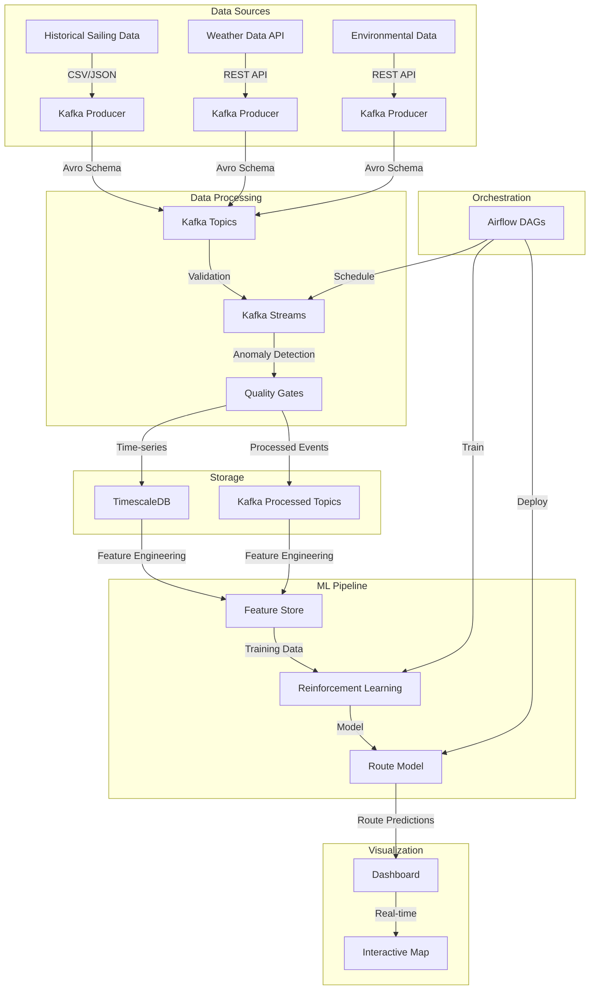

# Maritime Route Optimization Exercise: Reinforcement Learning for Vessel Navigation

## Overview
This exercise simulates a maritime route optimization system using reinforcement learning. The system processes historical sailing data, weather conditions, and environmental hazards to optimize vessel routes for fuel efficiency and safety.

## Architecture Components



## Project Structure
```
maritime-rl/
├── helm/
│   ├── kafka/
│   ├── timescaledb/
│   ├── airflow/
│   └── argocd/
├── data/
│   ├── historical/
│   ├── weather/
│   └── environmental/
├── src/
│   ├── maritime/
│   │   ├── schemas/
│   │   ├── producers/
│   │   ├── processors/
│   │   ├── features/
│   │   ├── models/
│   │   └── visualization/
├── scripts/
│   ├── start_services_sequential.sh
│   ├── run_demo.sh
│   ├── monitor_kafka.py
│   └── start_dashboard.sh
├── tests/
├── docker/
└── docs/
    └── user_guide.md
```

## Data Schemas

### 1. Historical Sailing Data
```json
{
  "type": "record",
  "name": "SailingRecord",
  "fields": [
    {"name": "vessel_id", "type": "string"},
    {"name": "timestamp", "type": "long"},
    {"name": "position", "type": {
      "type": "record",
      "name": "Position",
      "fields": [
        {"name": "latitude", "type": "double"},
        {"name": "longitude", "type": "double"}
      ]
    }},
    {"name": "speed", "type": "double"},
    {"name": "heading", "type": "double"},
    {"name": "fuel_consumption", "type": "double"},
    {"name": "weather_conditions", "type": {
      "type": "record",
      "name": "Weather",
      "fields": [
        {"name": "wind_speed", "type": "double"},
        {"name": "wave_height", "type": "double"},
        {"name": "current_speed", "type": "double"}
      ]
    }}
  ]
}
```

### 2. Weather Data
```json
{
  "type": "record",
  "name": "WeatherData",
  "fields": [
    {"name": "timestamp", "type": "long"},
    {"name": "location", "type": {
      "type": "record",
      "name": "Location",
      "fields": [
        {"name": "latitude", "type": "double"},
        {"name": "longitude", "type": "double"}
      ]
    }},
    {"name": "forecast", "type": {
      "type": "array",
      "items": {
        "type": "record",
        "name": "ForecastPoint",
        "fields": [
          {"name": "time", "type": "long"},
          {"name": "wind_speed", "type": "double"},
          {"name": "wind_direction", "type": "double"},
          {"name": "wave_height", "type": "double"},
          {"name": "current_speed", "type": "double"},
          {"name": "current_direction", "type": "double"}
        ]
      }
    }}
  ]
}
```

### 3. Environmental Data
```json
{
  "type": "record",
  "name": "EnvironmentalData",
  "fields": [
    {"name": "timestamp", "type": "long"},
    {"name": "location", "type": {
      "type": "record",
      "name": "Location",
      "fields": [
        {"name": "latitude", "type": "double"},
        {"name": "longitude", "type": "double"}
      ]
    }},
    {"name": "hazards", "type": {
      "type": "array",
      "items": {
        "type": "record",
        "name": "Hazard",
        "fields": [
          {"name": "type", "type": "string"},
          {"name": "severity", "type": "int"},
          {"name": "radius", "type": "double"},
          {"name": "description", "type": "string"}
        ]
      }
    }}
  ]
}
```

## Implementation Steps

### 1. Local Development Environment Setup
```bash
# Install Docker and Docker Compose
brew install docker docker-compose

# For K8s deployment (optional)
brew install kubectl helm

# Create the required network
docker network create maritime-network

# Start all services in the correct sequence
./maritime-rl/scripts/start_services_sequential.sh
```

### 2. Data Generation
- Create synthetic historical sailing data
- Simulate weather API responses
- Generate environmental hazard data
- Implement data quality checks

### 3. Kafka Setup
- Configure Schema Registry
- Set up topics with appropriate partitions
- Implement producers for each data type
- Create validation rules

### 4. Kafka Streams Implementation
```java
// Example Kafka Streams topology for data processing
StreamsBuilder builder = new StreamsBuilder();

KStream<String, SailingRecord> vesselData = builder.stream(
    "vessel_sailing_data",
    Consumed.with(Serdes.String(), sailingRecordSerde)
);

// Data validation and cleaning
KStream<String, SailingRecord> validData = vesselData
    .filter((key, value) -> value != null && isValid(value));

// Calculate derived metrics
KStream<String, EnrichedSailingRecord> enrichedData = validData
    .mapValues(value -> enrichWithMetrics(value));

// Detect anomalies
KStream<String, EnrichedSailingRecord> withAnomalyFlags = enrichedData
    .mapValues(value -> detectAnomalies(value));

// Write to output topic
withAnomalyFlags.to(
    "processed_sailing_data",
    Produced.with(Serdes.String(), enrichedSailingRecordSerde)
);
```

### 5. TimescaleDB Configuration
```sql
-- Create hypertable for vessel telemetry
CREATE TABLE vessel_telemetry (
    time TIMESTAMPTZ NOT NULL,
    vessel_id TEXT NOT NULL,
    position_lat DOUBLE PRECISION,
    position_lon DOUBLE PRECISION,
    speed DOUBLE PRECISION,
    heading DOUBLE PRECISION,
    fuel_consumption DOUBLE PRECISION,
    weather_wind_speed DOUBLE PRECISION,
    weather_wave_height DOUBLE PRECISION,
    weather_current_speed DOUBLE PRECISION
);

SELECT create_hypertable('vessel_telemetry', 'time',
    chunk_time_interval => INTERVAL '1 day',
    compress_after => INTERVAL '7 days'
);
```

### 6. Feature Engineering
- Calculate vessel performance metrics
- Create weather impact features
- Generate hazard avoidance features
- Build composite features for RL

### 7. Reinforcement Learning Model
- Define state space (vessel position, weather, hazards)
- Create action space (heading changes, speed adjustments)
- Implement reward function
- Train model using historical data

### 8. Airflow DAGs
```python
from airflow import DAG
from airflow.operators.python import PythonOperator
from datetime import datetime, timedelta

default_args = {
    'owner': 'airflow',
    'depends_on_past': False,
    'start_date': datetime(2024, 1, 1),
    'email_on_failure': False,
    'email_on_retry': False,
    'retries': 1,
    'retry_delay': timedelta(minutes=5),
}

dag = DAG(
    'maritime_route_optimization',
    default_args=default_args,
    description='Maritime route optimization pipeline',
    schedule_interval='@daily',
)

# Define tasks
data_validation = PythonOperator(
    task_id='validate_data',
    python_callable=validate_data,
    dag=dag,
)

feature_engineering = PythonOperator(
    task_id='calculate_features',
    python_callable=calculate_features,
    dag=dag,
)

model_training = PythonOperator(
    task_id='train_model',
    python_callable=train_model,
    dag=dag,
)

model_deployment = PythonOperator(
    task_id='deploy_model',
    python_callable=deploy_model,
    dag=dag,
)

# Set task dependencies
data_validation >> feature_engineering >> model_training >> model_deployment
```

### 9. Visualization Dashboard
- Create Flask-based dashboard
- Implement interactive map
- Show real-time route predictions
- Display model performance metrics

## Reinforcement Learning Details

### RL Environment

The RL environment simulates maritime navigation with:

- **State space**: 
  - Vessel position (lat, lon)
  - Vessel state (speed, heading, fuel level)
  - Local weather conditions
  - Nearby hazards
  - Distance to destination

- **Action space**:
  - Speed adjustments (increase, maintain, decrease)
  - Heading adjustments (5° increments)

- **Reward function**:
  ```python
  def calculate_reward(state, action, next_state):
      reward = 0
      
      # Distance to goal reward
      prev_distance = haversine(state.position, GOAL_POSITION)
      current_distance = haversine(next_state.position, GOAL_POSITION)
      reward += (prev_distance - current_distance) * DISTANCE_REWARD_FACTOR
      
      # Fuel consumption penalty
      reward -= next_state.fuel_consumption * FUEL_PENALTY_FACTOR
      
      # Safety rewards/penalties
      if is_near_hazard(next_state.position):
          reward -= HAZARD_PENALTY
      
      # Weather condition penalties
      weather_risk = calculate_weather_risk(next_state)
      reward -= weather_risk * WEATHER_PENALTY_FACTOR
      
      # Arrival bonus
      if is_at_destination(next_state.position):
          reward += DESTINATION_BONUS
          
      return reward
  ```

### Algorithm Choice
- **Proximal Policy Optimization (PPO)** for its sample efficiency and stability
- Deep neural network to approximate policy and value functions
- Experience replay to improve sample efficiency

## Running the System

### 1. Starting Services
Start all services in the correct sequence:

```bash
./maritime-rl/scripts/start_services_sequential.sh
```

This script ensures that:
- Services are started in the correct dependency order
- Each service is healthy before starting dependent services
- Required networks and volumes are created

### 2. Running the Demo
Run the demo script to generate test data and process it:

```bash
./maritime-rl/scripts/run_demo.sh
```

The demo will:
- Generate vessel sailing data with realistic patterns
- Process data through Kafka Streams
- Store processed data in TimescaleDB
- Verify data is stored correctly
- Start the visualization dashboard

### 3. Access Points
The system consists of several components accessible via web interfaces:

- **Kafka UI**: http://localhost:8080
- **Schema Registry**: http://localhost:8081
- **pgAdmin**: http://localhost:5050 (admin@maritime.com / maritime_admin)
- **Airflow**: http://localhost:8090 (admin / maritime_admin)
- **Dashboard**: http://localhost:5500

### 4. Working with Airflow
To trigger the data pipeline and model training:

1. Access Airflow at http://localhost:8090
2. Enable both the `maritime_data_pipeline` and `maritime_model_training` DAGs
3. Trigger the DAGs manually using the "play" button
4. Monitor execution in the Airflow UI

### 5. Monitoring
You can monitor Kafka messages in real-time using:

```bash
./scripts/monitor_kafka.py --topics vessel_sailing_data processed_sailing_data
```

### 6. Using the Dashboard
The dashboard provides visualization of vessel data and routes:

1. Access the dashboard at http://localhost:5500
2. View vessel positions on the map
3. Click vessels to see detailed telemetry
4. Compare standard routes with optimized routes
5. Monitor fuel consumption and efficiency metrics

## Monitoring

### Key Metrics to Monitor
- Kafka consumer lag
- Kafka Streams processing throughput
- TimescaleDB query performance
- Model training metrics:
  - Average reward per episode
  - Success rate (reaching destination)
  - Fuel efficiency
- System resource utilization

### Monitoring Tools
- Prometheus for metrics collection
- Grafana for visualization
- Kafka UI for Kafka monitoring
- Airflow monitoring for DAG status

### Dashboard Layout
```
+---------------------+---------------------+
|                     |                     |
|   Route Map View    |   System Metrics    |
|                     |                     |
+---------------------+---------------------+
|                     |                     |
| Vessel Performance  |   Model Metrics     |
|                     |                     |
+---------------------+---------------------+
|                                           |
|           Data Pipeline Status            |
|                                           |
+-------------------------------------------+
```

## Conclusion
This exercise provides a comprehensive example of building a reinforcement learning system for maritime route optimization. It covers the full data pipeline from ingestion through Kafka, processing with Kafka Streams, storage in TimescaleDB, feature engineering, model training with RL, and visualization of results.

For detailed step-by-step instructions, refer to the User Guide in the `docs/` directory. 